# **Vulnerability Scores**
1. **CVE Score**: If the vulnerability being evaluated already has a **CVE** score, use this score directly in the metadata.yml file 

2. **CVSS calculator**: If the score is not available, you must calculate it using the [CVE CVSS calculator](https://www.first.org/cvss/calculator/4.0). This tool will help you determine the vulnerability score based on various impact and exploitability parameters.

	To facilitate this process, diagrams have been created that explain which parameters and options you must choose in each case. These diagrams will guide you through the different possible scenarios, ensuring that the calculated score is accurate and consistent with CVSS standards.
Then the basic flow:

- Access CVE's CVSS calculator version 4.0 (most current): [CVSS Calculator](https://www.first.org/cvss/calculator/4.0)
	
- Select the relevant parameters: Follow the diagrams provided to choose the correct parameters and options for each type of vulnerability.
- Get the score: Enter the parameters in the calculator and use the score generated in the metadata.yml file

Users should use the base score of the vulnerability if available. If not available, users must fill in the base metrics to calculate the score.

**Diagrams**:

These diagrams are designed to make the calculation process as clear and straightforward as possible.
#
**Attack Vector (AV)**

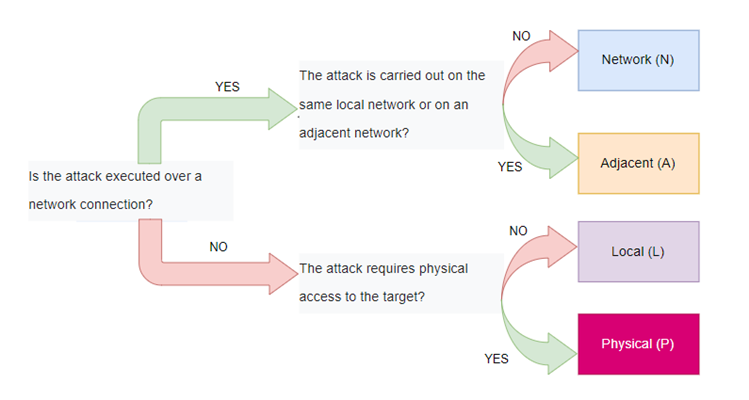
#
**Attack complexity (AC)**

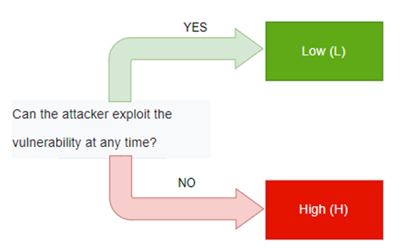
#
**Attack Requirements (AR)**

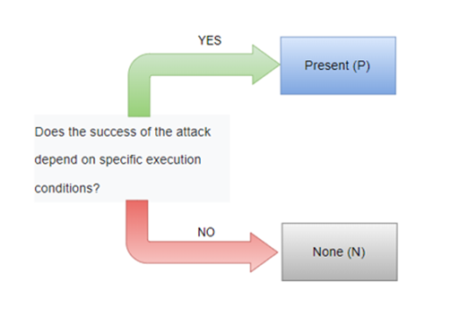
#
**Privileges Required (PR)**

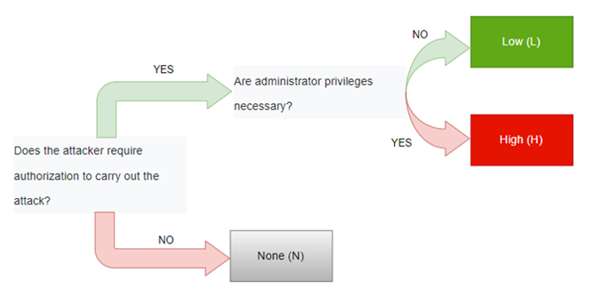
#
**User interaction (UI)**

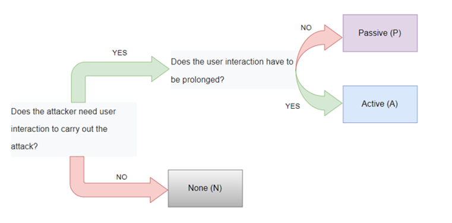
#
**Confidentiality (VC), Integrity (VI), Availability (VA)**

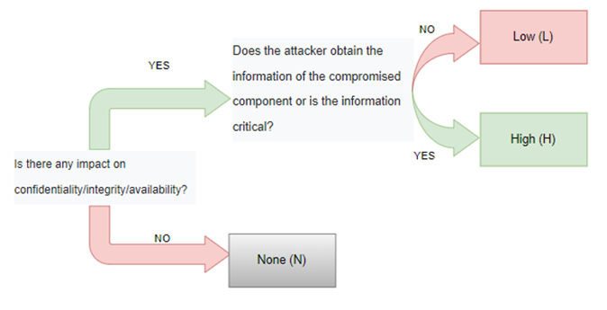
#
**Confidentiality (SC), Integrity (SI), Availability (SA)**

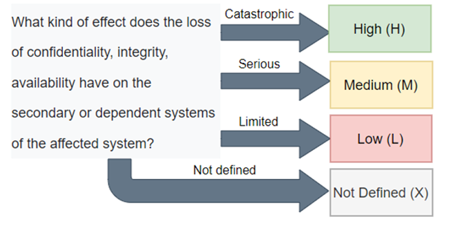
#
**Safety (S)**

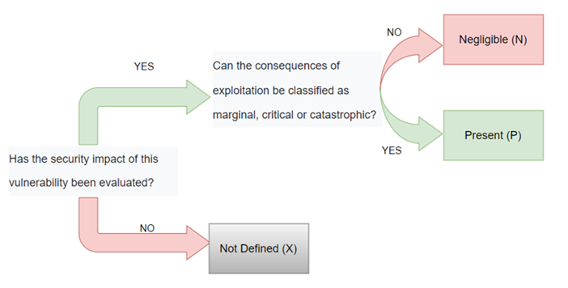
#
**Automatable (AU)**

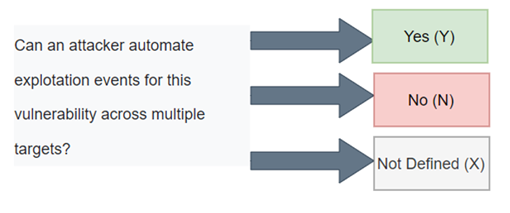
#
**Recovery (R)**

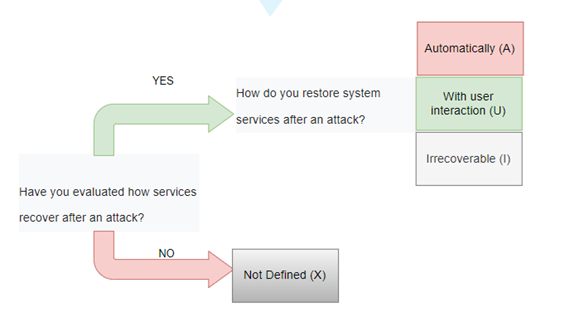
#
**Value Density (V)**

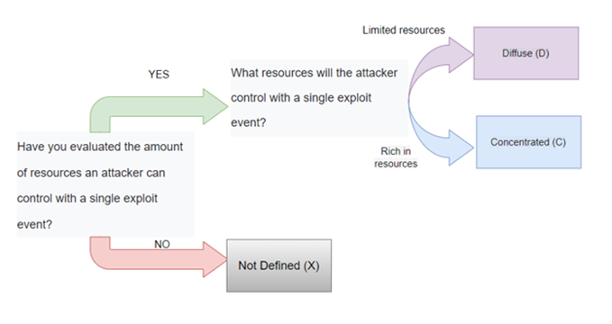
#
**Vulnerability Response Effort (RE)**

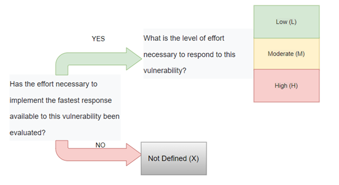
#
**Provider Urgency (U)**

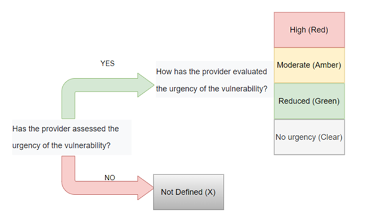
#
**Confidentiality Requirements (CR), Integrity Requirements (IR), Availability Requirements (AR)**

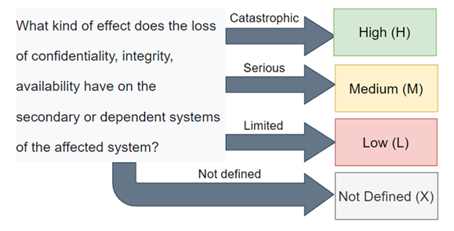

